## 计算机毕业设计Python深度学习动漫推荐系统 动漫视频推荐系统 机器学习 协同过滤推荐算法 bilibili动漫爬虫 数据可视化 数据分析 大数据毕业设计 混合神经网络推荐算法 SVD 卷积神经网络 SVM 机器学习 Scrapy爬虫 协同过滤推荐算法 混合神经网络推荐算法 PySpark Hadoop Hive Hadoop PySpark 机器学习 深度学习 Python Scrapy分布式爬虫 机器学习 大数据毕业设计 数据仓库 大数据毕业设计 文本分类 LSTM情感分析 大数据毕业设计 知识图谱 大数据毕业设计 预测系统 实时计算 离线计算 数据仓库 人工智能 神经网络

## 要求
### 源码有偿！一套(论文 PPT 源码+sql脚本+教程)

### 
### 加好友前帮忙start一下，并备注github有偿纯python动漫推荐2025
### 我的QQ号是2827724252或者798059319或者 1679232425或者微信:bysj2023nb 或bysj1688

# 

### 加qq好友说明（被部分 网友整得心力交瘁）：
    1.加好友务必按照格式备注
    2.避免浪费各自的时间！
    3.当“客服”不容易，repo 主是体面人，不爆粗，性格好，文明人。

### 演示视频

https://www.bilibili.com/video/BV1Nw4m1e7F3/?spm_id_from=333.999.0.0

### 运行截图

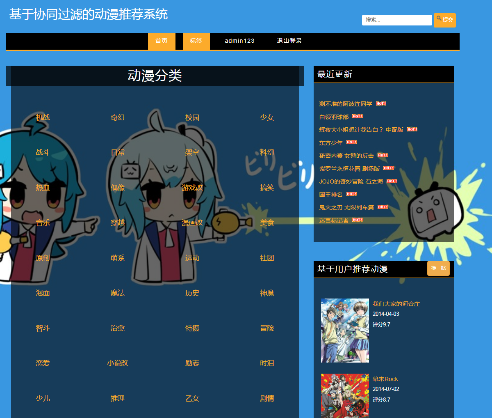
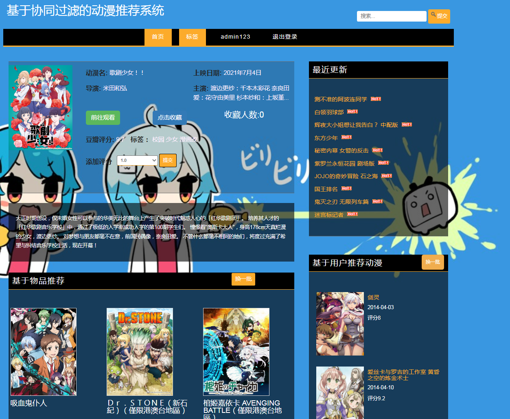

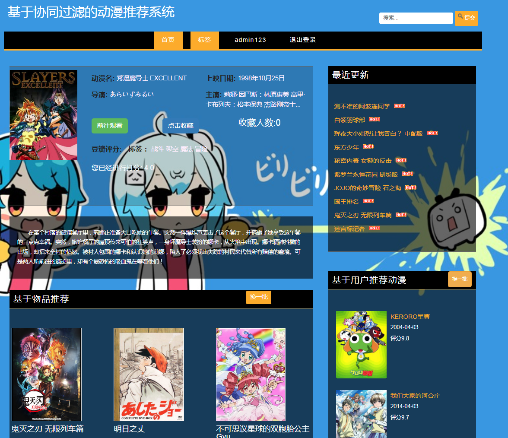

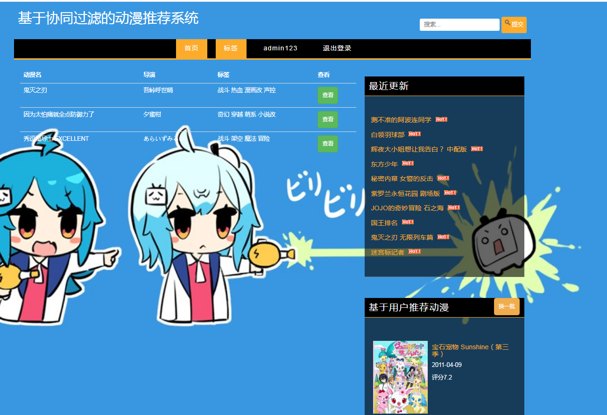
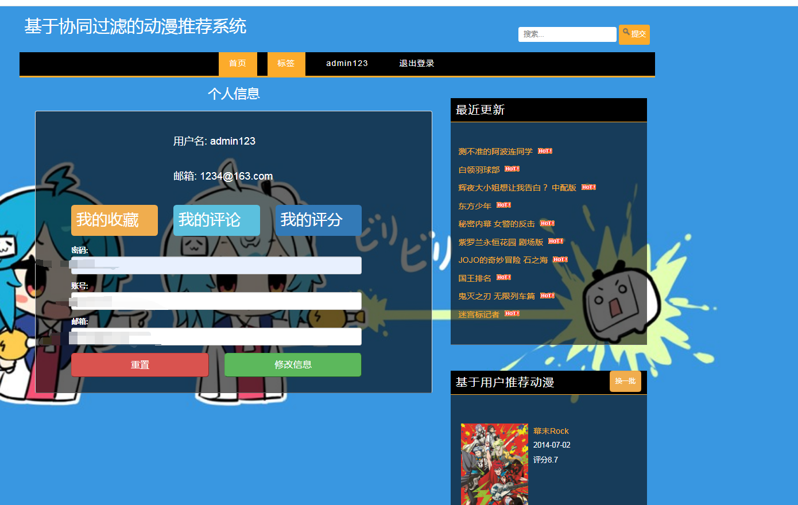
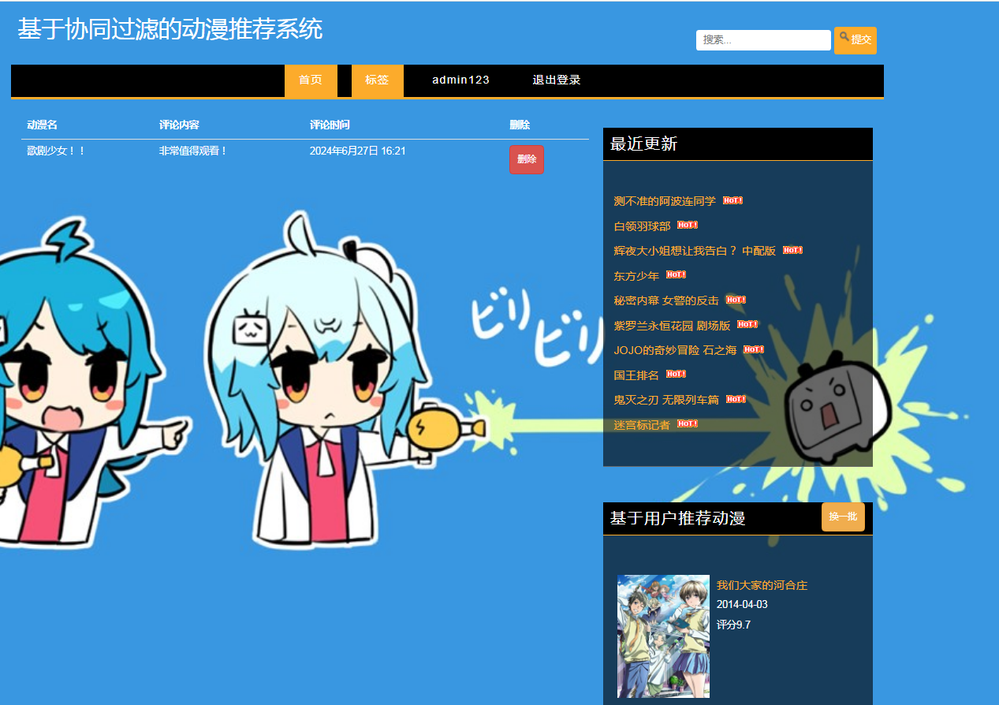
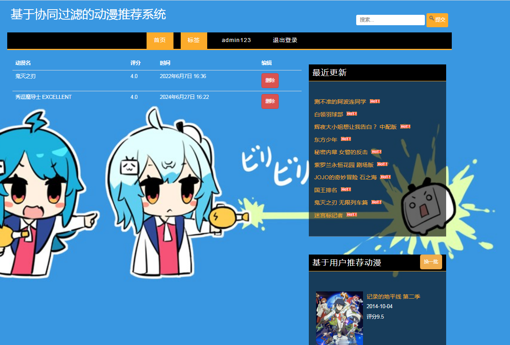
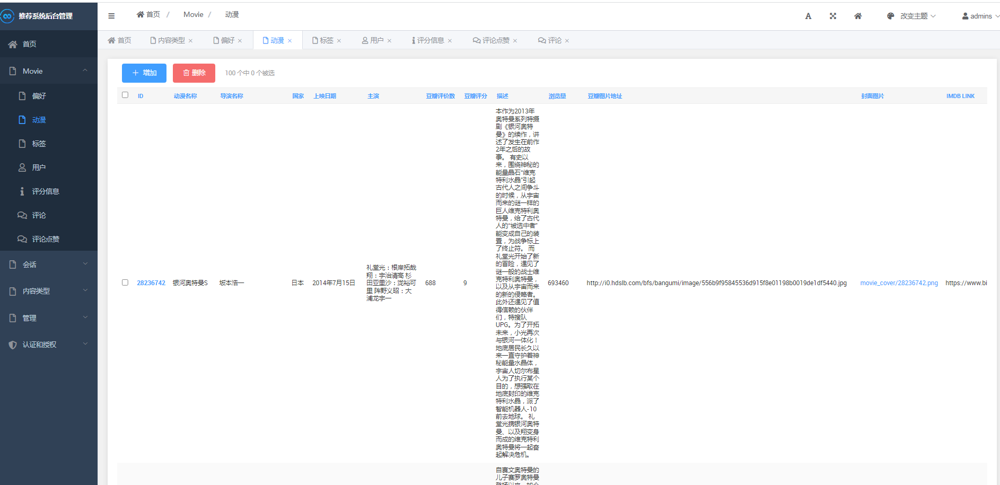
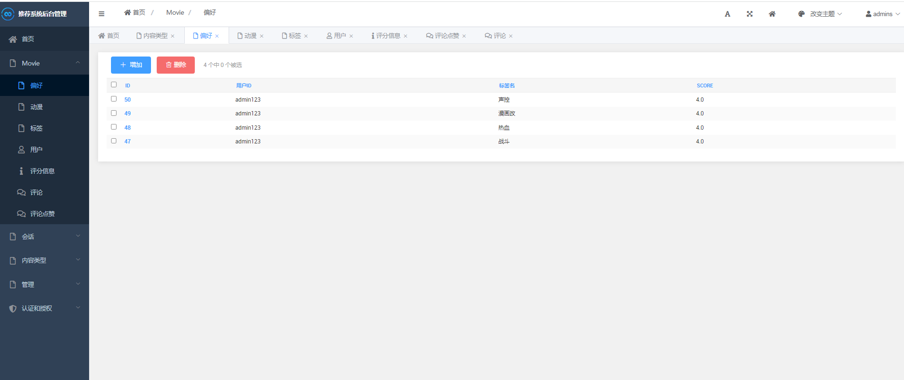
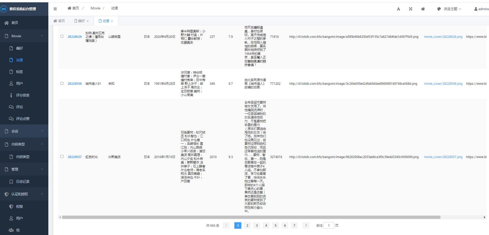
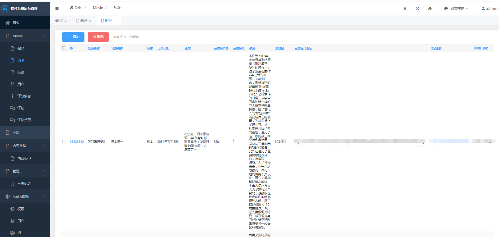
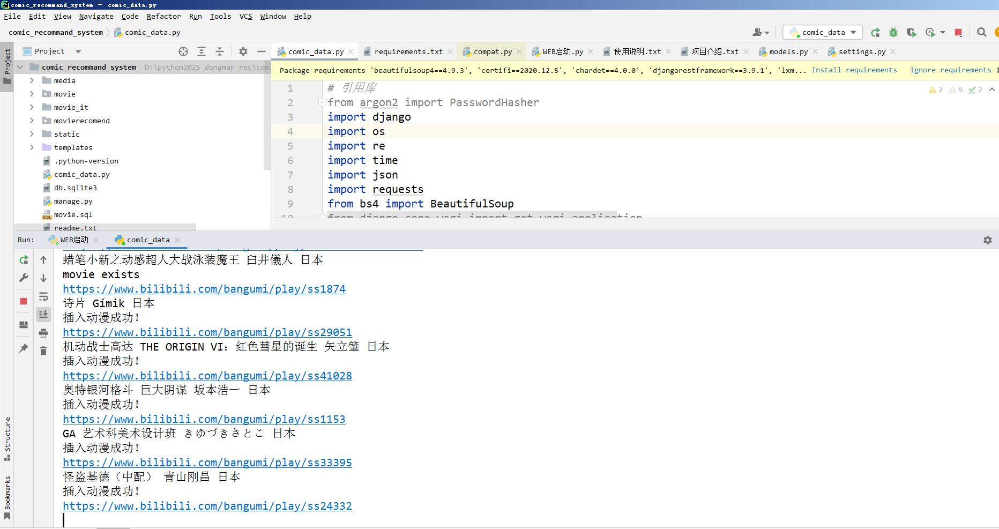
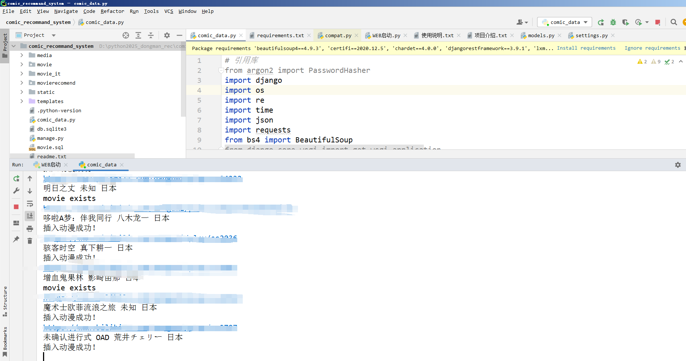
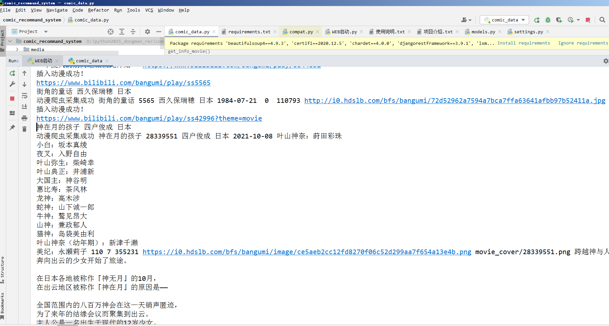
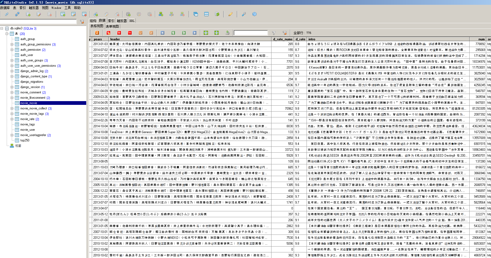

### 毕设介绍

本推荐系统采用的是分层模型设计思想，第一层为前端页面模型设计，注重为实现页面的展示效果，主用的编程语言为JavaScript,和前端主流框架bootstrap。
第二层为后端模型设计，编程语言选了简单易懂的python，用Django作为后端框架进行开发，此框架是python web系统开发的首选框架，简单易用。
第三层为算法的设计与实现的逻辑，用协同过滤算法来实现，第四层为数据库表的设计，用SQLite数据库。
本系统web端的功能模块，主要实现动漫显示、动漫分类显示、热门动漫排序显示、收藏动漫排序显示、时间排序显示、评分排序显示、算法推荐、动漫搜索、动漫信息管理等功能，并进行数据库的详细设计，完成设计阶段的各项功能，并对此系统进行功能测试，最后，系统进行相关的实际应用操作，通过系统的使用，用户进入动漫推荐系统，此系统可以根据用户对动漫所打的标签行为，给用户推荐用户所感兴趣的动漫，准确率在百分之75左右，用户可以查看信息，观看动漫，给动漫评分等操作，本系统基本上完成了预期的基本功能。

该推荐系统基于协同过滤算法实现，采用了分层模型设计思想，并使用了多种技术栈进行开发。

技术栈：
1. 前端页面模型设计：JavaScript和前端主流框架bootstrap，用于实现页面的展示效果。
2. 后端模型设计：Python作为编程语言，Django作为后端框架进行开发。Django是一个简单易用的Python web开发框架。
3. 算法设计与实现逻辑：采用协同过滤算法来实现推荐功能。
4. 数据库表设计：使用SQLite数据库进行数据存储。

实现步骤：
1. 前端页面模型设计：使用JavaScript和bootstrap框架搭建用户界面，实现动漫显示、分类显示、排序显示等功能。
2. 后端模型设计：使用Django框架搭建后端服务器，处理前端请求，调用相应的算法进行推荐计算，并将结果返回给前端页面。
3. 算法设计与实现逻辑：采用协同过滤算法来实现推荐功能。具体步骤包括：
   - 初始化数据：获取用户的浏览行为数据。
   - 计算两个用户的皮尔逊相关系数：通过遍历整个数据集，计算用户之间的相似度。
   - 寻找最相似的用户：根据用户之间的相似度，找到与当前用户最相似的N个用户。
   - 推荐动漫给用户：根据最相似的用户的浏览行为，推荐动漫给当前用户。
4. 数据库表设计：使用SQLite数据库进行数据存储，包括用户信息、动漫信息、用户对动漫的评分等。

通过以上步骤，该推荐系统实现了基于用户和基于物品的推荐功能，根据用户的标签行为和评分情况，给用户推荐其感兴趣的动漫。系统具有良好的用户界面和高准确率的推荐效果，用户可以方便地查看动漫信息、观看动漫、给动漫评分等操作。整个系统的开发过程经过详细的设计和功能测试，并成功应用于实际场景中。

项目目录结构：
    |-- comic_data.py  # 动漫数据抓取模块
    |-- db.sqlite3  # SQLite数据库文件
    |-- manage.py  # Django管理命令入口
    |-- movie
    |   |-- __init__.py  # 模块初始化文件
    |   |-- admin.py  # Django后台管理配置文件
    |   |-- apps.py  # Django应用配置文件
    |   |-- data.py  # 动漫数据处理模块
    |   |-- forms.py  # 表单定义文件
    |   |-- migrations  # 数据库迁移文件夹
    |   |-- models.py  # 数据库模型定义文件
    |   |-- serializers.py  # 序列化器定义文件
    |   |-- templatetags  # 模板标签文件夹
    |   |   |-- __init__.py
    |   |   |-- grav_tag.py  # 自定义模板标签：用于生成星级评分显示
    |   |   |-- is_like.py  # 自定义模板标签：用于判断用户是否喜欢某部动漫
    |   |   `-- list_slice.py  # 自定义模板标签：用于切片列表
    |   |-- tests.py  # 测试文件
    |   `-- views.py  # 视图函数定义文件
    |-- movie.sql  # 动漫数据的SQL文件
    |-- movie_it
    |   |-- cache_keys.py  # 缓存键定义文件
    |   |-- data.json  # 数据JSON文件
    |   |-- douban_crawler.py  # 豆瓣爬虫模块
    |   |-- play_2.py  # 播放模块
    |   |-- populate_movies_script.py  # 动漫数据填充脚本
    |   `-- recommend_movies.py  # 推荐动漫模块
    |-- movierecomend
    |   |-- __init__.py  # 模块初始化文件
    |   |-- settings.py  # Django项目配置文件
    |   |-- templatetags  # 模板标签文件夹
    |   |   |-- __init__.py
    |   |   |-- grav_tag.py  # 自定义模板标签：用于生成星级评分显示
    |   |   `-- list_slice.py  # 自定义模板标签：用于切片列表
    |   |-- urls.py  # URL配置文件
    |   `-- wsgi.py  # WSGI应用程序入口
    |-- readme.txt  # 项目说明文档
    |-- requirements.txt  # 项目依赖库列表
    |-- static  # 静态文件目录
    |   |-- css  # CSS文件
    |   |-- images  # 图片文件
    |   `-- js  # JavaScript文件
    |-- templates  # 模板文件目录
    |   |-- all_tags.html  # 显示所有标签的页面模板
    |   |-- base.html  # 基础模板
    |   |-- base_show.html  # 基础展示模板
    |   |-- choose_tag.html  # 选择标签的页面模板
    |   |-- items.html  # 动漫列表展示页面模板
    |   |-- login.html  # 登录页面模板
    |   |-- movie.html  # 单个动漫展示页面模板
    |   |-- my_comment.html  # 我的评论页面模板
    |   |-- my_rate.html  # 我的评分页面模板
    |   |-- mycollect.html  # 我的收藏页面模板
    |   |-- personal.html  # 个人信息页面模板
    |   |-- register.html  # 注册页面模板
    |   |-- results.html  # 搜索结果页面模板
    |   `-- tag_movie.html  # 标签对应动漫页面模板

